+++
title = "Пример проекта 3d печати"
date = "2022-01-26T21:26:32+04:00"
author = "gals"
cover = ""
tags = ["3d печать", "хобби"]
keywords = ["3d печать", "хобби"]
description = "Пример процесса изготовления детали с нуля"
showFullContent = false
readingTime = true
hideComments = false

+++
А вот бывает купил ты себе пылесос ручной на батарейке. XIAOMI SHUNZAO Z1 Pro Vacuum например. И все тебя устраивает и мусор убирает отлично и чистить легко, и небольшой (размером с 1,5 литровую бутылку), ну, в общем все, что ты вообще хотел от такого пылесоса, есть. А до этого одна попытка подобрать такой кончилось тем что ты его нафик выкинул, а другая - в гараж убрал. А это вот этот самое то. Исполнил наконец мечту. Ну или нашел что бы ее кто-то исполнил и купил :)  Но вот удобного органайзера к нему производитель не предусмотрел.

Если ты не инженер и у тебя нет 3D принтера, то ты об этом даже, наверно, не пожалел(а). Если ты инженер, то возможно даже ты об этом пожалел(а). А вот если ты инженер и у тебя есть 3D принтер то история немного удлиняется.

Сначала берется штангенциркуль и нужные мест обмериваются. Потом открывается OpenSCAD и там, после некоторого обдумывания, пишется примерно такой код.

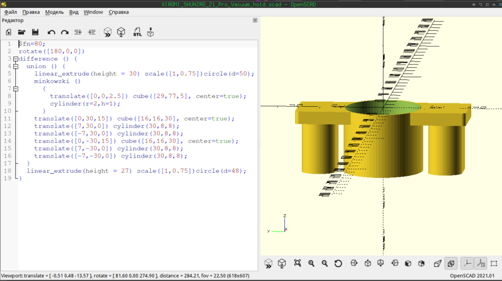

После этого генерится STL файл который загоняется в Cura. Cura анализирует это файл и  в зависимости от настроек (которых примерно миллион, такие как температура головы, толщина слоя, надо ли поддержки печатать или нет, как заполнять массивные детали, на какую температуру греть столик, и далее, далее, далее),  хотя шучу, немного настроек немного меньше миллиона,

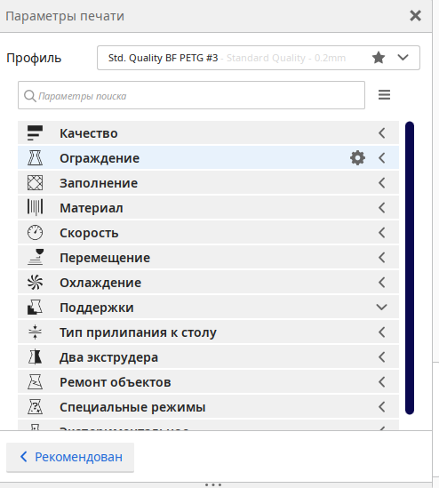

генерит файл с gcode. Из которого понятно сколько пластика и времени это займет, а так же, если ввели цену пластика, то даже цену детали.

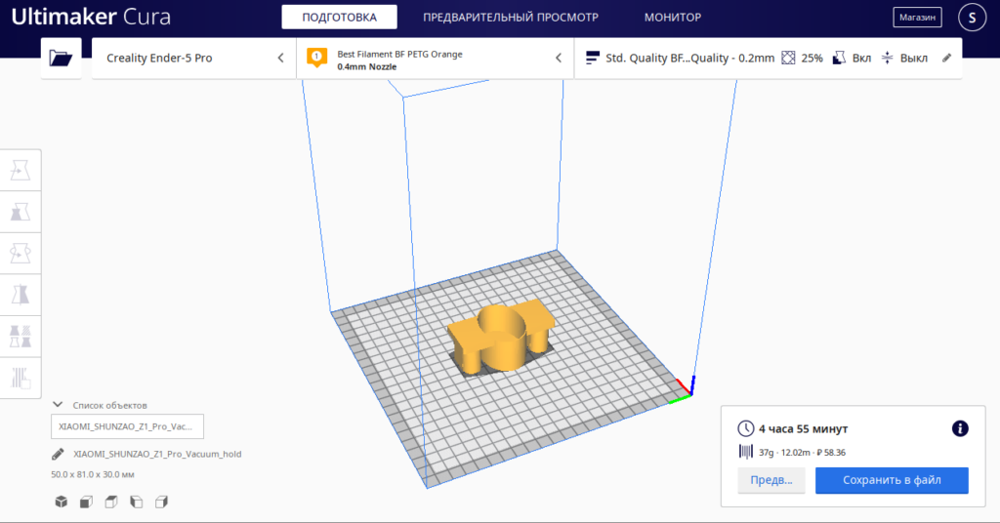

Далее можно, конечно, залить файлк с gcode на флешку, воткнуть в принтер и распечатать. Но настоящему инженеру этого быстро становится мало. И он ставит [octoprint](https://octoprint.org/). Я как раз из таких и история продолжается :)

Открывается UI octopring и в него заливается полученный gcode. В UI можно теперь посмотреть как то что будет делать принтер

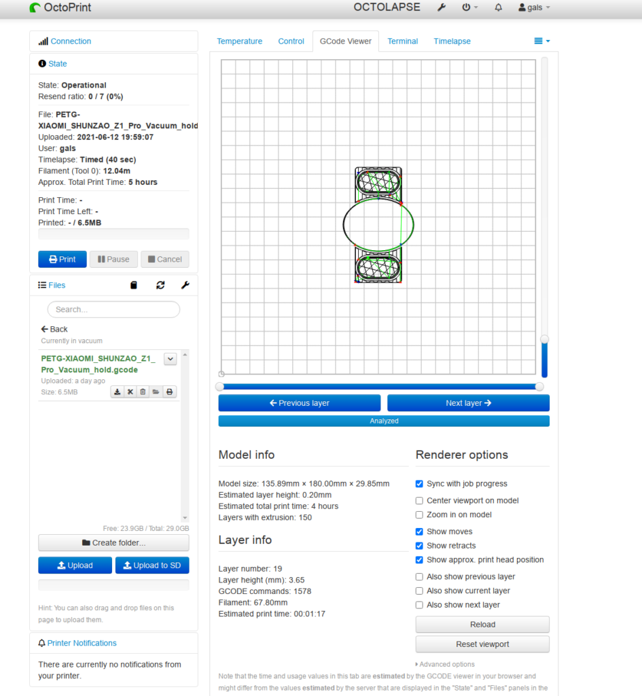

Так как обычно у octoprint быстро вырастает камера, то в нем можно посмотреть как  и что именно принтер  делает сейчас (именно тут - нефига не делает, тока грозно жужжит вентиляторами)

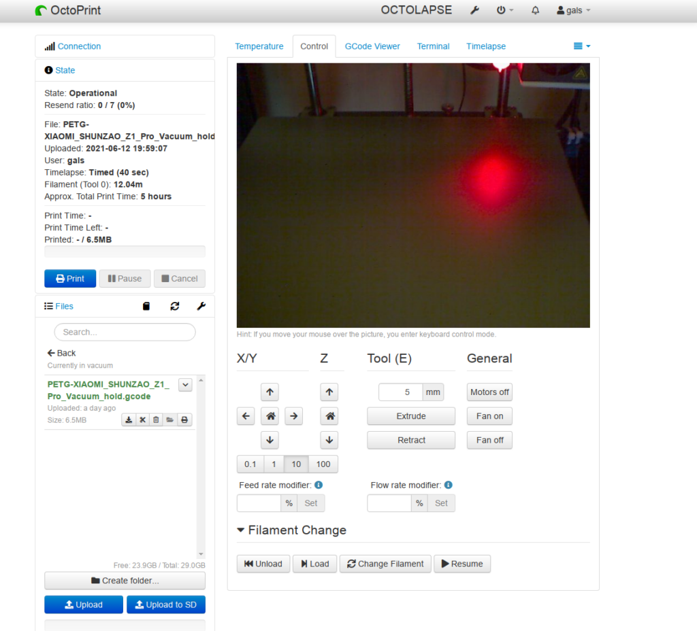

Отправляем на печать и ждем, как обещала Cura, около 5 часов. Так как в этом octoprint стоит плагин OCTOLAPSE мы можем посмотреть как это было



<video width=100% controls autoplay>
    <source src="3d-print.mp4" type="video/mp4">
    Your browser does not support the video tag.
</video>



На самом деле бегать и смотреть это конечно не дело, но именно для этого я и поставил octoprint. Во-первых я могу через [octoprint](https://play.google.com/store/apps/details?id=com.kabacon.octoremote&hl=ru&gl=US) посмотреть текущий статус прям с телефона. А с использованием VPN домой я могу посмотреть статус с телефона вообще с любого места где есть впн. Ксати, так же я могу выключить принтер удаленно через mihome потому что он подключен через умную розетку. Ну зачем ему стоять и жужать вентиляторами если печать закончена или пофейлилас.

Но на самом деле мне и следить-то не надо. Потому что для octoprint есть плагин для телеги. И он мне там все сам отпишет. Например что печать пофейлилась (в данном случае потому что я задание отменил). Выглядит в телеге это примерно так

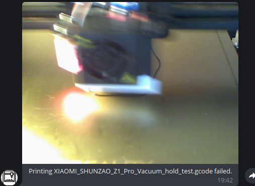

Или, например, что печать успешно завершена

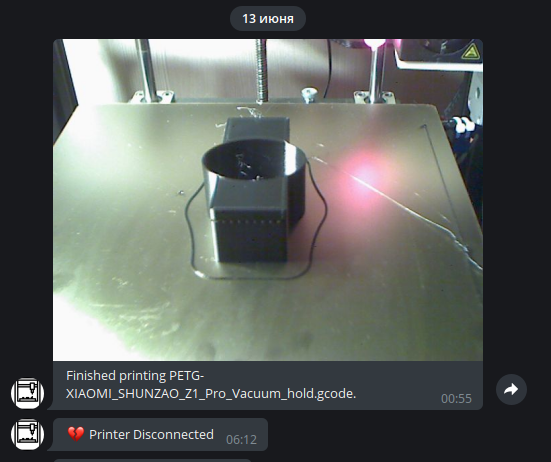

Так же тут  видно что печать завершилась в 00:55, а я проснулся только в 6:12 и отрубил принтер.

Ну и результат :)

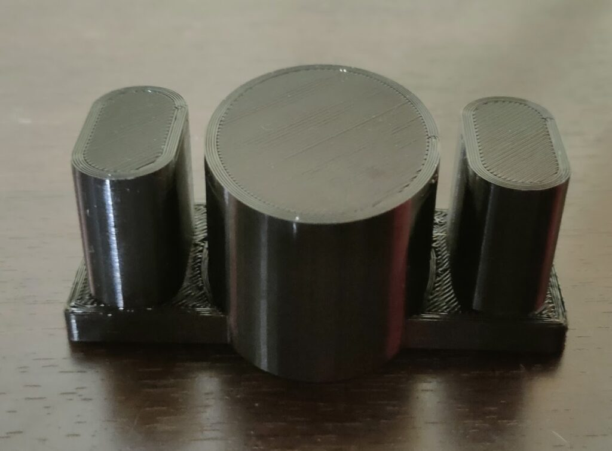

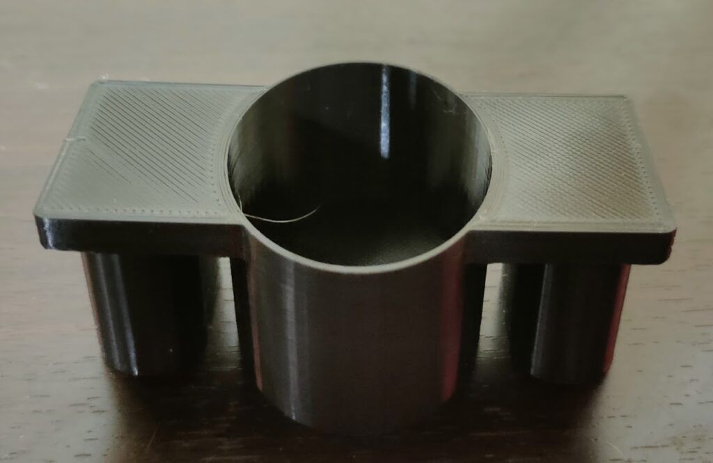

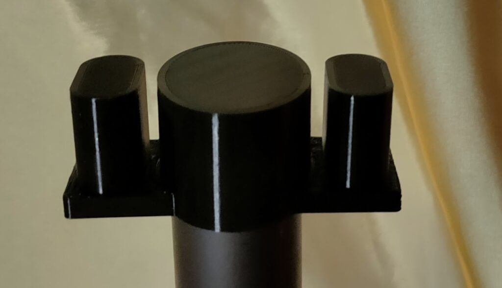

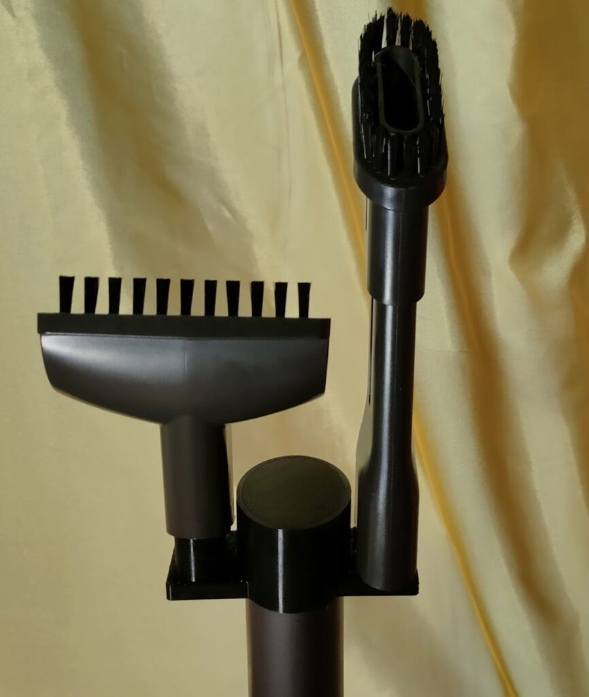

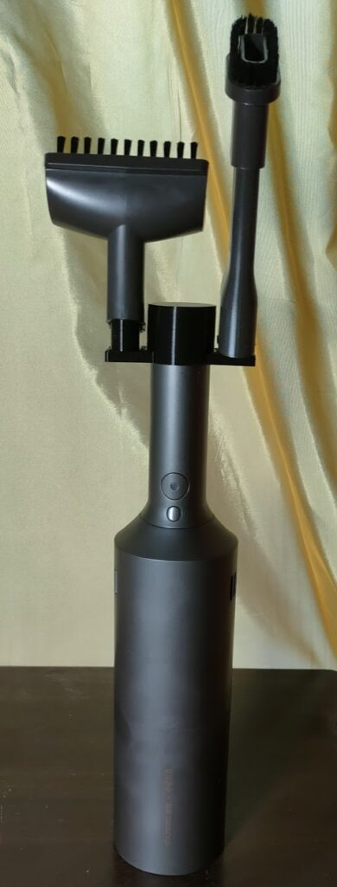

В общих чертах процесс выглядит именно так. Правда была еще одна печать, тестовая, только части детали, что бы понять что с овалами для ручки и насадок ошибок не было. Ошибки были обнаружены, исправлены в OpenSCAD, и весь процесс был повторен, но уже в нужном объеме :)

Ну а дальше остались мелочи конечно. Поделиться, вдруг это кому-то тоже надо :) Наработки были выложены сюда [thingiverse](https://www.thingiverse.com/thing:4884652) и [github](https://github.com/sergeygalkin/3d_print/commit/b5ba629936540a93419ff893a336af6d31f3c18e).

_Update от декабря 2021 года._

Через пару месяцев выяснились недостатки существующего дизайна :) Во-первая стакан оказался слишком тонкий и вся нижняя часть оторвалась от стакана, во-вторых стакан был недостаточно глубокий, а в-третьих мне пришла в голову мысль что стакан в виде стакана не очень нужен и вместе с утолщением, от некоторых его частей можно смело оказаться (и пластика меньше уйдет и печать быстрее пройдет). Обновление уже на [github](https://github.com/sergeygalkin/3d_print/commit/436efe41638fbdf7893d969ec3308921668219b0), и выглядит это теперь вот так

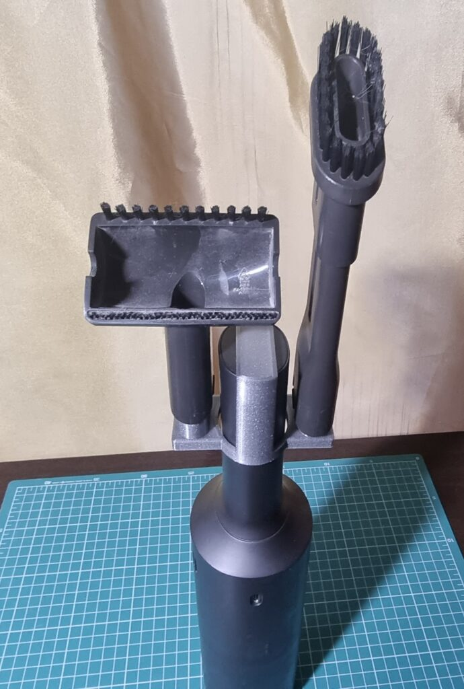

### Ссылки {#links}

- мои проекты на [гитхабе](https://github.com/sergeygalkin/3d_print)
- мои дизайны на [thingiverse](https://www.thingiverse.com/sergeygals/designs)
- [Улучшение 3d печати](/posts/3d-print-advanced/)
- [Введение в 3d печать](/posts/3d-print-intro/)
