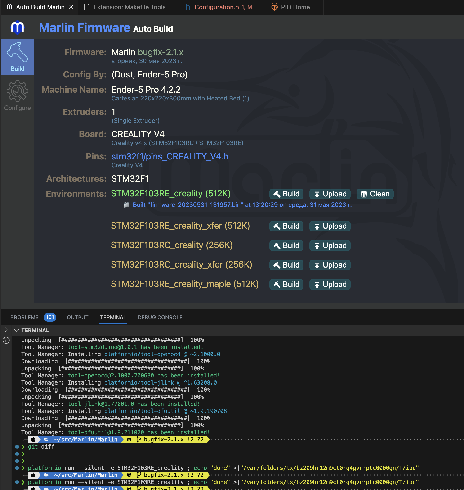

+++
title = "Index"
date = "2023-06-01T09:06:16+04:00"
author = "sergeygals"
authorTwitter = "" #do not include @
cover = ""
tags = ["хобби", "3d печать", "ender", "ender 5"]
keywords = ["хобби", "3d печать", "ender", "ender 5"]
description = "Сборка Marlin 2.x для Ender 5 Pro"
showFullContent = false
readingTime = true
hideComments = false
+++
## Исходный сетап

1. Ender 5 Pro
2. [OctoPrint](https://octoprint.org/) на Raspberry PI 3
3. BL-Touch для принтеров CR-10/CR-10S/CR-10 V2/Ender-3/Ender-3 Pro/Ender-3 V2
4. Silent Mainboard Ender-5 Pro v4.22

## Подготовка (VSCode, PlatformIO, Auto Build Marlin)

Все по мануалу из [этого видоса](https://www.youtube.com/watch?v=_tnVl4X2p20)

## Готовим исходники

```
mkdir ~/src/Marlin
git clone https://github.com/MarlinFirmware/Marlin ~/src/Marlin/Marlin
git clone https://github.com/MarlinFirmware/Configurations \
  ~/src/Marlin/Configurations
cd ~/Marlin/
cp Configurations/config/examples/Creality/Ender-5\ Pro/CrealityV422/*  \
  Marlin/Marlin/
```

[источник](https://lodge.glasgownet.com/2021/08/17/compiling-marlin-firmware-for-the-ender-5-pro-v4-2-2-board-with-bltouch/)

## Редактируем и собираем

Открываем ~/src/Marlin/Marlin как PlatformIO как показано в видосике ссылка на который была выше и генерируем среду сборки как там показно.

в VS Code открываем ~/src/Marlin/Marlin/Marlin/Configuration.h и правим там тупо всего 4 строки

1. Комментим два error в начале
2. Раcкоменчиваем `#define ENDER5_USE_BLTOUCH`
3. Коментим `#define Z_MIN_PROBE_USES_Z_MIN_ENDSTOP_PIN` (потому что плата 4.2.2 с 5-pin header)

на всякий случай и для наглядности - diff

```
❯ diff ~/src/Marlin/Configurations/config/examples/Creality/Ender-5\ Pro/CrealityV422/Configuration.h ~/src/Marlin/Marlin/Marlin/Configuration.h
23,24c23,24
< #error "Don't build with import-2.1.x configurations!"
< #error "Use the 'bugfix...' or 'release...' configurations matching your Marlin version."
---
> // #error "Don't build with import-2.1.x configurations!"
> // #error "Use the 'bugfix...' or 'release...' configurations matching your Marlin version."
26c26
< //#define ENDER5_USE_BLTOUCH
---
> #define ENDER5_USE_BLTOUCH
1352c1352
< #define Z_MIN_PROBE_USES_Z_MIN_ENDSTOP_PIN
---
> //#define Z_MIN_PROBE_USES_Z_MIN_ENDSTOP_PIN
```

говорят можно еще поправить NOZZLE_TO_PROBE_OFFSET, но я еще не добрался попробовать.

Далее идем в Auto Build Marlin, жамкаем Build напротив STM32F103RE_creality (512K)


в итоге получаем .bin файл который пишем на SD карту, втыкаем в принтер и включаем принтер с  этой картой, что приводит к автоматической заливке прошивки.

## Калибровки

### Столик

Тут все тупо, как описано в [мануале](https://marlinfw.org/docs/features/auto_bed_leveling.html#first-time-bed-leveling).
Команды вводим в терминале в octoprint, так проще чем вертеть ручку и выбирать меню. # и все что за ним не вводим, это типа комментарии

```
M111 S247 # включаем дополнительный логинг
G28 # делаем Auto Home
G29 # калибруем уровень столика
M500 # сохраняем все откалиброванное в EEPROM
```

Пробуем печатать. Скорее всего получим мы паутинку вместо ожидаемой детали потому что BLTouch при калибровке запоминает рельеф стола, но точно выставить расстояние до стола он не может. Это приводит к тому что печать начинается выше чем надо, деталь не крепится дном и елозит по всему столу. Вообще в Marlin есть целый визард (Z-Offset Wizard), но у меня визардом не получилось. В результате разных попыток появились вот такие работающие шаги:

1. G28 (Auto Home), эта процедура отведет голову по оси Z на +10 мм примерно от 0
2. Выводим аккуратно, меняя шаг в сторону уменьшения, голову по оси Z, так что бы между экструдером и столом можно было провести бумажку, но она немного цеплялась. Как в классической ручной калибровке столика винтами снизу, только без винтов. У меня получилось что это было выше нуля и на экране было -1.75.
3. В терминале octoprint загоняем двумя строками 'M851 Z-1.75' и 'M500'. В меню z probe offset при этом теперь показывает +1.75

На этом фсе. Мира и добра всем.


