+++
title = "Про гамаки"
date = "2020-09-10T22:16:03+04:00"
author = "sergeygals"
cover = ""
tags = ["туризм"]
keywords = ["туризм" ]
description = "Немного про гамаки"
showFullContent = false
readingTime = true
hideComments = false
+++
В гамаках я сплю довольно часто на природе когда есть деревья. Последние два 7 дневных сплава в Карелии спал именно в гамаке.

## Как правильно спать

Сразу начну с главного, с вопроса - 'а как спина ?'. Спина отлично, надо просто не натягивать гамак, вешать его под углом 30-40 градусов, и ложиться наискосок. Картинки прилагаю. Тогда спина ровная и все норм. Что интересно, на обычной кровати я когда сплю
кручусь так что с утра простынь надо по новой расправлять. Даже если он с поддерживающийся резинкой. В гамаке желание повернуться
очень редкое, обычно как засыпаешь на спине так и спишь всю ночь.

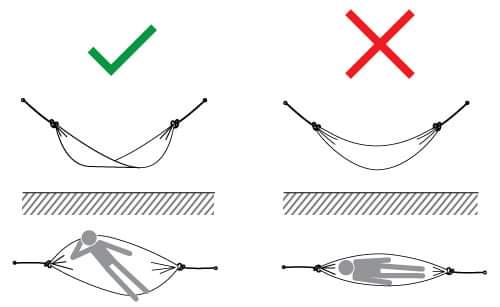

Картинка из инструкции к гамаку Naturehike Bushcraft Double DC-CO4-DAWN (модель NH22DC004)

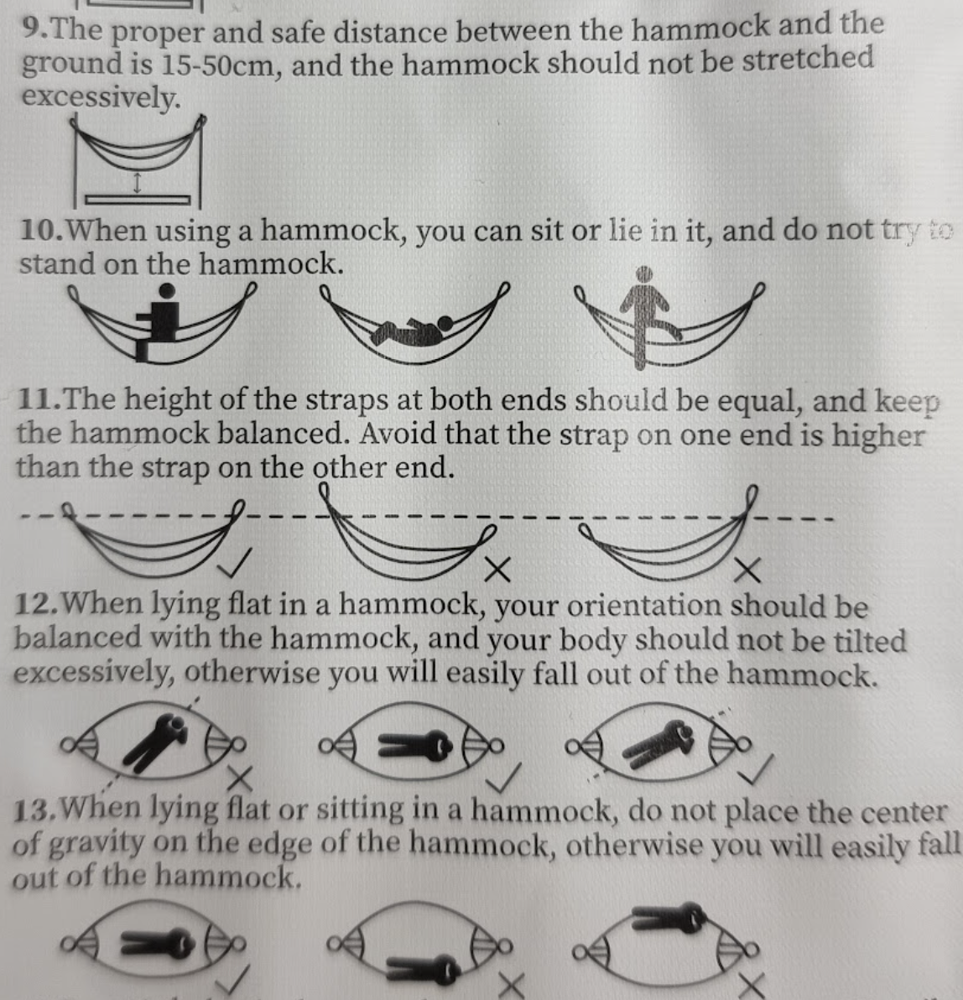

## Утеплители

Вторая проблема - прохлада. Гамак тонкий, вес приминает одежду уменьшая ее теплозащитные свойства и спине и попе холодновато. Это легко решается утеплителем.

Утеплитель может быть как внешним и подвешиваться снаружи гамака как ENO Ember UnderQuilt (ссылок не даю, они меняются и у того же ENO линейка постоянно обновляется но названия пока не меняются, тот же ENO Ember UnderQuilt версии 2023 отличается немного от версии 2020 которая у меня). C этим утеплителем только одна проблема. Когда гамак висит, в нем лежит спальник, а еще сверху висит сетка а на улице темно, то надо быть внимательным при укладывании. Можно промахнуться мимо гамака приняв край утеплителя за него. Утеплитель - не несущая штука, он держится на резинках для лучшего облегания когда вы лежите, и в результате промаха немного падаешь на землю что само по себе не очень приятно. А еще рвешь сетку от комаров если она внешняя типа ENO Guardian Bug Net. В при одном таком падении я немного надорвал сетку и отломил у нее 3 верхних пластмассовых крюка за которые она крепиться на веревку сверху. Для ENO Guardian Bug Net это оказалось не фатально, дырки были зашиты а в крюках были еще  и дырки через которые тоже можно протянуть веревку. [Видосик про утеплители](https://www.youtube.com/watch?v=KadEAcVhQiY)

Еще утеплитель может быть тупо пенкой или ковриком самонадувающим. Можно кинуть его в гамак. Я сам так не пробовал, но видел видео где люди так делали. А можно не кидать, а купить гамак Naturehike Bushcraft Double DC-CO4-DAWN (модель NH22DC004). У него для пенки есть двойное дно и молния. Туда замечательно лезет надувной коврик Naturehike Ultra-light Inflatable Pad (CNH22DZ018) размером 196x64x7 см. Примерно так

## Сетка

Третья проблема - комары. Есть гамаки (например на али экспрессе) в которых сетка пришита к краям и застегивается сверху. Это не очень правильно. Комары легко прокусывают гамак и одежду. Сетка должна быть подвешена на веревочку сверху и свисать снизу. Я брал набор ENO OneLink DoubleNest Navy и в нем есть и правильная сеточка от комаров и тент с колышками. Правильность сеточки в том что она висит вокруг гамака, и комар не укусит вас через гамак. Правда если у вас утеплитель снаружи комар фик подберется :) Еще в нем удобные веревочки (какие то полужесткие, легко завязывать и развязывать) и очень удобная подвеска.

## Крепление к дереву

Ну и про крепления к дереву. Наиболее стандартный и удобный вариант - на самом гамаке - карабин, а на дерево - стропы с петлями.
Не советую использовать карабины из строительных магазинов (ими обычно комплектуют недорогие гамаки с али). Он тяжелый и у него острые грани которые цепляются и лохматят веревку и рвут гамак. Лучше всего взять нормальный альпинистский карабин типа такого

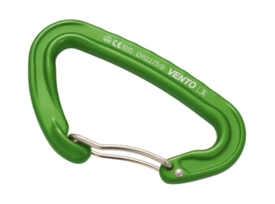

Одним конец стропы обхватываем вокруг дерева через петлю, а карабин втыкаем в нужную по расстоянию между деревьями другую петлю. Выглядят крепление примерно так (на примере ENO Atlas). На Али много аналогов подешевле.

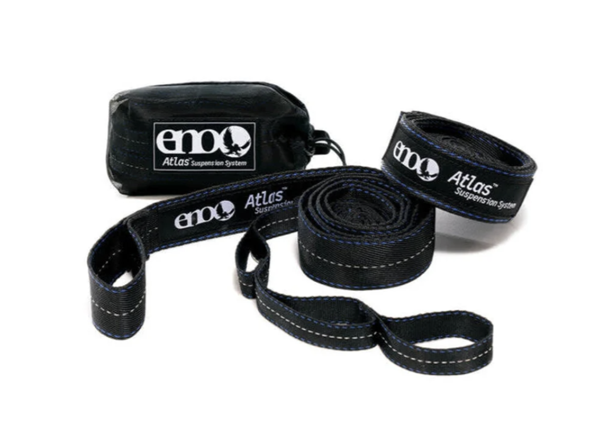

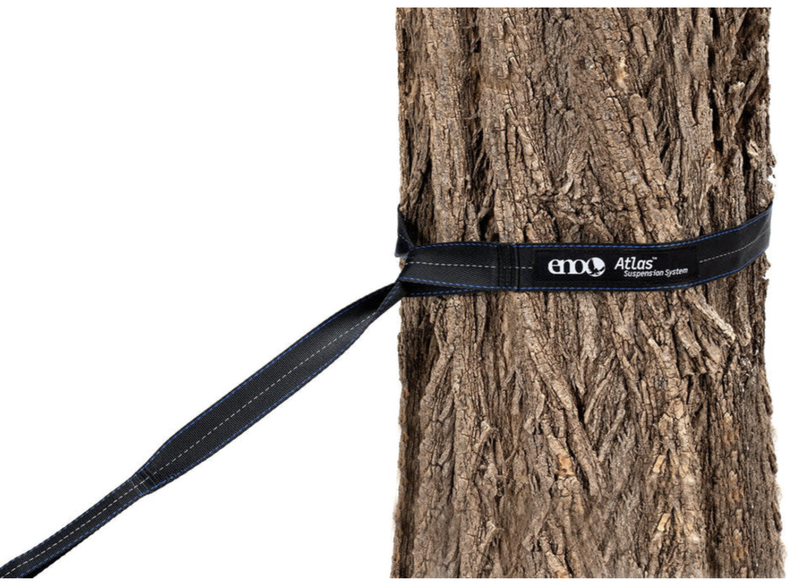

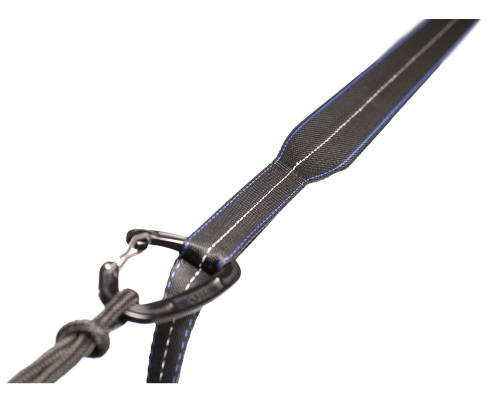

На самом деле из прочной альпинистский веревки при достаточном умении можно сделать аналог такой системы. Веревка складывается пополам, на конце делается петля для затяжки вокруг дерева, а потом через равные промежутки вяжутся узлы что бы сделать аналог петель на стропе. Получается объемнее и тяжелей строп, но дешевле.

Еще вариант - научится вязать узлы удобные для подвешивания гамака на простой веревке. Это реально но без постоянной практики быстро забывается.

Ну и экзотика. Есть, например, ультралегкая система подвеса [ENO Helios](https://www.youtube.com/watch?v=OwRC_vEAGDY), при совместимости с ней гамака и карабин на нем не нужен, там на гамаке специальная пуговка. Разрешенная нагрузка на него меньше чем у петли. А вот у Naturehike Bushcraft Double DC-CO4-DAWN
вообще все по другому, нет карабинов и строп с петлями. В комплекте идет просто крепкий паракорд который вставляется в специальное место в самом гамаке, и тупо наматывается на дерево встречно с обоих сторон.

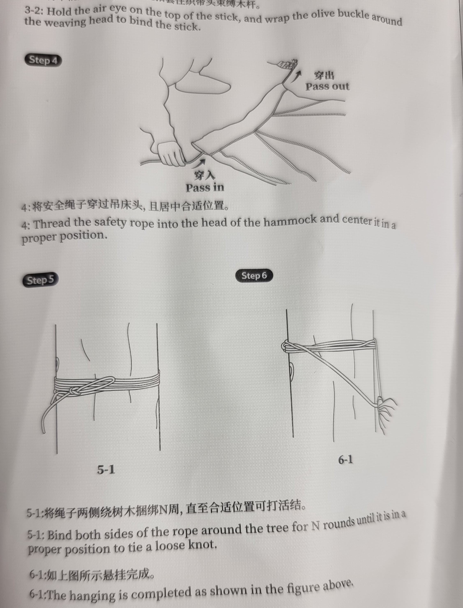

очень тупо, но вполне надежно, на узел на дереве приходится минимальная нагрузка поэтому умение вязать правильные узлы особо не требуется. Oпять же, минус вес и объемы карабинов.

## Итого

Спится отлично. В жару в гамаке не жарко, потому что он проветривается со всех сторон. В холод можно залезть в спальник или им накрыться. Рекомендую спальник одеяло, с ним удобнее, но в принципе и кокон норм. И никакого влажности и конденсата обычного для палаток. Также плевать на ровность земли под тобой, хоть корни там, хоть бугры, главное что бы там не было муравейника :)

Для получения дополнительных удобств можно использовать ENO Talon Ridgeline Grey. Это такой шнур и кошелечек в который можно положить смартфон c powerbank для зарядки, а так же подвесить на него что-то на карабин, например мультитул, в кармане в гамаке он будет явно лишним. А можно повесить на карабин шлем, если вы на сплаве, и туда тоже всякого наложить. На самом деле обычно сам гамак идет с пришитым кармашком в который обычно складывается сам, но в подвешенном состоянии кармашек свободно висит сбоку и туда тоже можно что-то тоже положить. Ну и плюс есть модели типа ENO JungleNest Evergreen, у него внутри нашито два кармашка, с краю и торца над головой.

Еще один огромный плюс - на ровность земли совершенно плевать, а вот историй - "мы поставили палатку, а там бугор и мы всю ночь вокруг него пытались спать" - дофига и больше. Недостаток, по моему, только один - вещи лежат достаточно открыто, но на самом деле я слышал массу историй как туземцы воровали вещи и из палаток ночью.

Для тех кто не верит что в классическом гамаке можно спать с прямой спиной недавно выпустили модель ENO SkyLoft Seafoam [вот она в спорт-марафоне](https://sport-marafon.ru/catalog/gamaki/gamak-eno-skyloft-seafoam-grey/), там будет все по шаблону :)

## Где и что покупать

- ENO (ниразу не дешево) - Самые иновационные гамаки из тех что я пользовал, есть в [Спорт-марафон](https://sport-marafon.ru/). Cпорт-марафон есть немного на озоне (и раз их товар на озоне почему то был дешевле чем в онлайн магазине даже с моей скидкой), но в их магазине выбор гораздо больше. Доставляют через Boxberry, много раз покупал, все четко, быстро, в Саратов привозят за 2-3 дня обычно.
- Naturehike - есть в [Спорт-марафон](https://sport-marafon.ru/), есть на Ozon, есть на Aliexpress. Пробовал только Bushcraft Double DC-CO4-DAWN (модель NH22DC004), интересная модель, рекомендую. Вообще все что есть у меня Naturehike - весьма приличное и меня полностью устраивает.
- No name c Али и Ozon - есть два гамака с али, один валяется в машине, другой лежит дома повесить, недорогие, за 5 лет оба не развалились, мои 115 кг держат нормально. Одна проблема только - отрывается или оторвался чехол в который гамак складывается. При покупке к ним шли ужасные карабины и веревки для подвески, их тупо выкинул и поменял на нормальные. На август 2023 такие комплекты стоят около 1000 рублей. За 2-3 тысячи можно взять с нормальными стропами и относительно нормальными карабинами (ну судя по фото). Для того что бы отдохнуть - норм. В походы их беру для того что бы на общак где-то у костра повесить, их не жалко. Спальное место себе делаю на ENO.
## Дополнительные источники

Еще много про рюкзаки и всякое легкоходство есть у [Сергея Савельева](https://sport-marafon.ru/komanda/1491192/) и на его [ютубе](https://www.youtube.com/@cosmohike3293)

## Фоточки

Ну и немного всего этого в действии в сплавах по Карелии

Карелия 2020

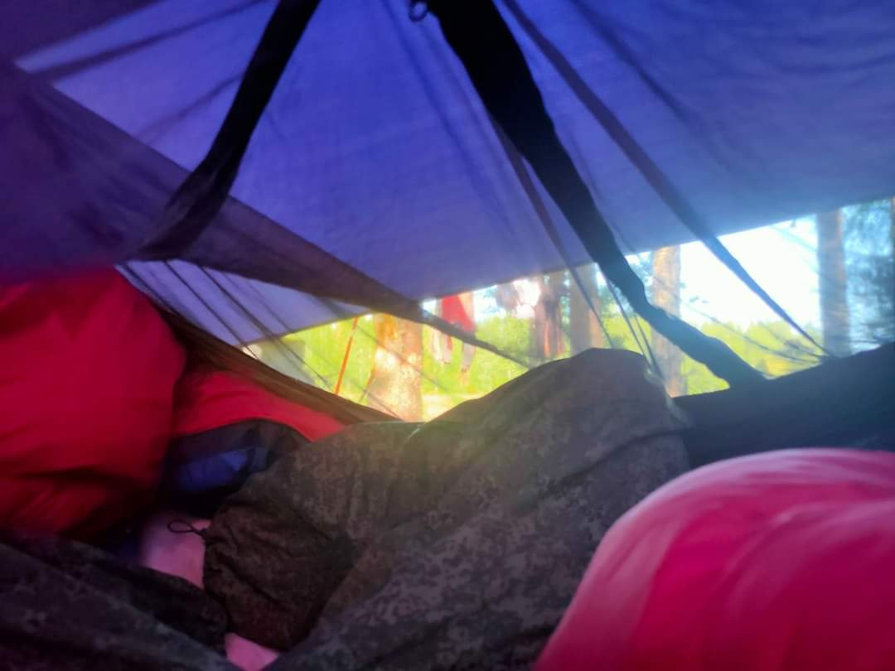

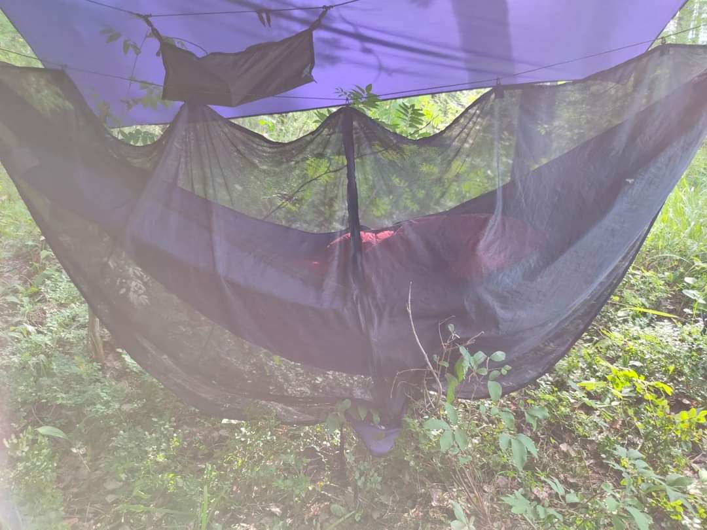

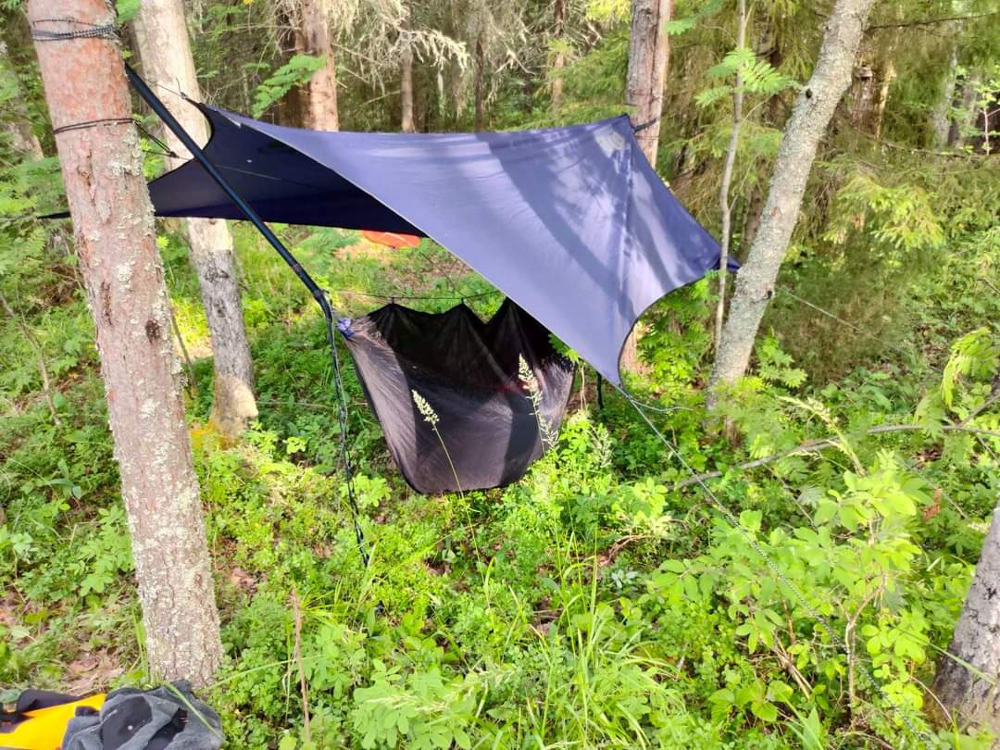

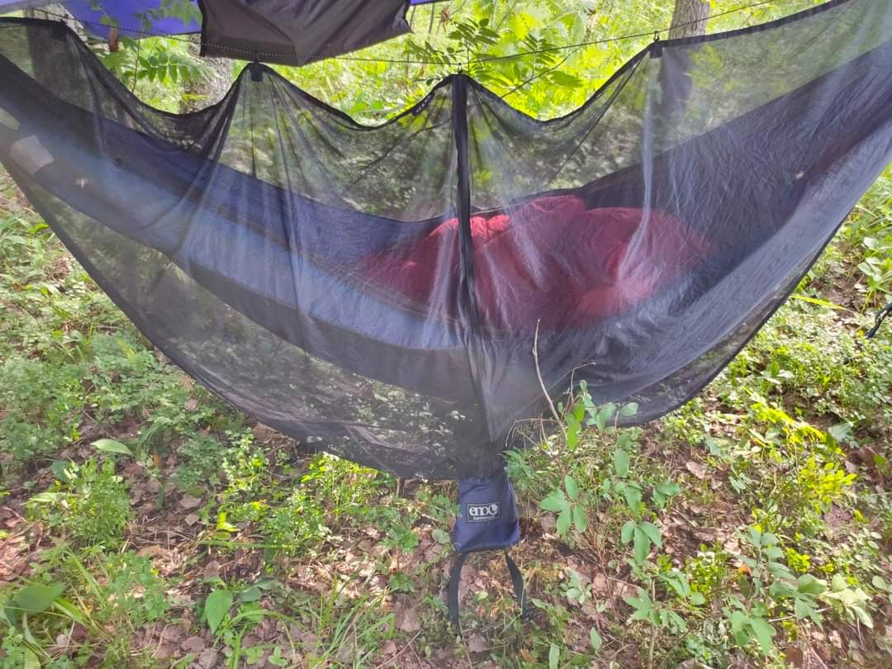

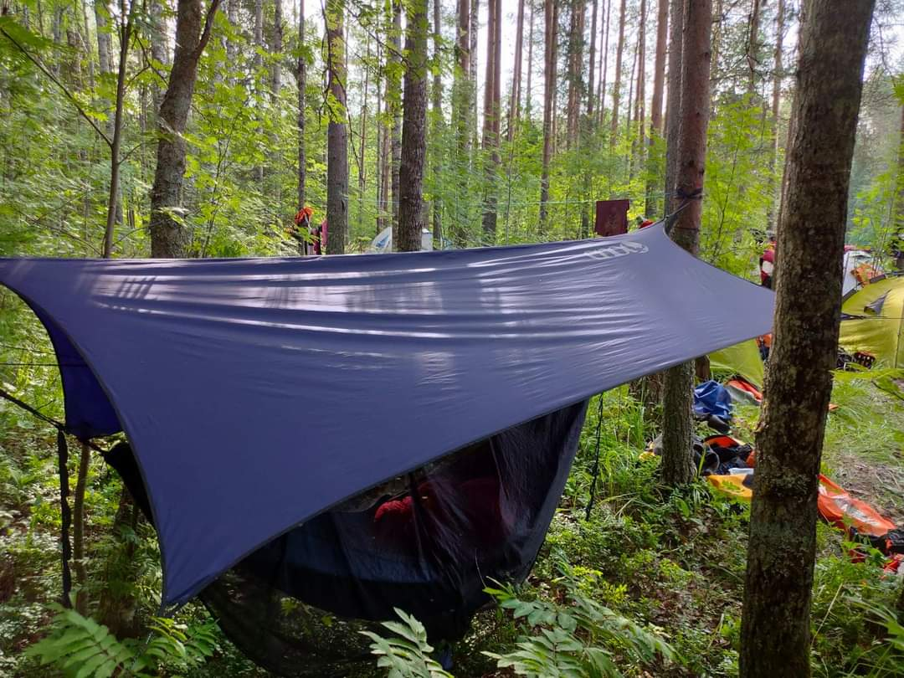

Карелия 2023

