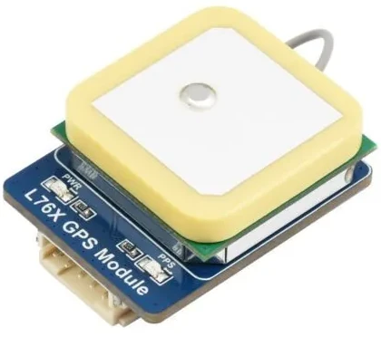
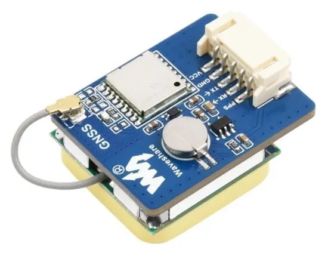
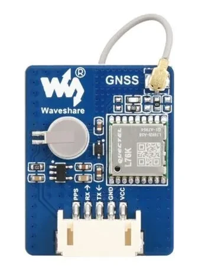

+++
title = "L72K GPS with Orange PI 5"
date = "2024-01-29T13:03:30+04:00"
author = "sergeygals"
authorTwitter = "" #do not include @
cover = ""
tags = ["orange pi 5", "kali", "kali linux", "gps", "L72K", "gpsd"]
keywords = ["", ""]
description = "L72K GPS with Orange PI 5"
showFullContent = false
readingTime = true
hideComments = true
+++

# Hardware

1. Orange PI 5
2. L76K module

|  |  |  |
|------------------------|------------------------|------------------------|

# Software

## Enable UART0 module on orange pi 5

1. Add `U_BOOT_FDT_OVERLAYS_DIR` and `U_BOOT_FDT_OVERLAYS` to `/etc/default/u-boot`
    ### **`/etc/default/u-boot`**
    ```/etc/default/u-boot
    ## /etc/default/u-boot - configuration file for u-boot-update(8)
    U_BOOT_MENU_LABEL="Kali Linux"
    U_BOOT_PARAMETERS="console=tty1 ro rootwait"
    U_BOOT_FDT="/boot/dtb/rockchip/rk3588s-orangepi-5.dtb"
    U_BOOT_FDT_OVERLAYS_DIR="/boot/dtb-5.10.110-rockchip-rk3588/rockchip/overlay"
    U_BOOT_FDT_OVERLAYS="rk3588-uart0-m2.dtbo"
    ```
2. Run `sudo u-boot-update` and `sudo reboot`.
3. Make sure `/dev/ttyS0` exists after reboot.
4. Check work by `sudo minicom -D /dev/ttyS0 -b 9600`, you should see likes this output:
    ```
    $GNVTG,,,,,,,,,N*2E
    $GNZDA,095735.000,29,01,2024,00,00*4B
    $GPTXT,01,01,01,ANTENNA OK*35
    ```

## Configure gpsd

1. Install by `apt install gpsd`
2. Edit `/etc/default/gpsd`
    ```
    DEVICES="/dev/ttyS0"
    GPSD_OPTIONS=""
    USBAUTO="true"
    ```
3. Start gpsd by `sudo systemctl start gpsd`
4. Check output for `sudo cgps`
